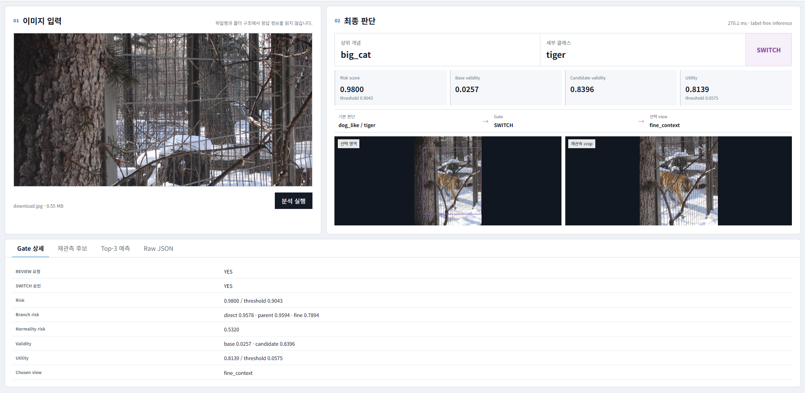

# Dual-Line Perception and Judgment System

한 장의 이미지를 입력하면 Parent/Fine 예측을 만들고, 판단 위험이 큰 경우에만 선택적으로 재관측한 뒤 기존 판단을 유지하거나 후보로 전환하는 이미지 분류 데모입니다.

## 실제 추론 예시



초기 판단에서 Fine은 `tiger`를 유지했지만 Parent는 `dog_like`로 분류했습니다. 위험 탐지 후 `fine_context` 영역을 재관측했고, 후보 증거의 유효성이 높아져 최종 Parent 판단을 `big_cat`으로 전환했습니다. 이 과정에서 정답 라벨, 파일명, 폴더명은 런타임 판단에 사용되지 않습니다.

```text
Raw image
  -> Parent / Fine base prediction
  -> Error-risk detection
  -> KEEP or selective REVIEW
  -> Candidate evidence comparison
  -> REVIEW_KEEP or SWITCH
  -> Final prediction
```

런타임은 입력 이미지의 정답 라벨, 파일명 또는 폴더명을 판단 feature로 사용하지 않습니다.

## 데모 실행

### 1. 저장소 루트로 이동

```powershell
cd <repository-root>
```

다른 위치에 저장소를 내려받았다면 해당 저장소 루트로 이동합니다.

### 2. Python 환경 활성화

기존 가상환경이 포함된 작업 사본에서는 다음 명령을 사용합니다.

```powershell
.\.venv\Scripts\Activate.ps1
```

현재 데모는 Python 3.12 환경에서 확인했습니다. 새 환경을 만드는 경우 필요한 주요 패키지는 다음과 같습니다.

```powershell
py -3.12 -m venv .venv
.\.venv\Scripts\Activate.ps1
python -m pip install --upgrade pip
python -m pip install -r requirements-demo.txt
```

### 3. 서버 실행

```powershell
python -m tools.serve_dual_line_demo
```

아티팩트 로딩이 끝나면 브라우저가 자동으로 열리고 터미널에 다음 내용이 표시됩니다.

```text
[READY] http://127.0.0.1:7860
[MODE] raw image input, no truth labels
```

자동으로 열리지 않으면 [http://127.0.0.1:7860](http://127.0.0.1:7860)을 직접 엽니다. `127.0.0.1`은 서버를 실행한 컴퓨터에서만 접근할 수 있는 로컬 주소입니다.

브라우저를 자동으로 열지 않으려면 다음과 같이 실행합니다.

```powershell
python -m tools.serve_dual_line_demo --no_browser
```

GPU를 명시하려면 `--device cuda`, CPU만 사용하려면 `--device cpu`를 추가합니다. 서버 종료는 실행 중인 터미널에서 `Ctrl+C`입니다.

첫 실행에서는 torchvision의 ResNet18 기본 가중치를 내려받을 수 있으므로 인터넷 연결이 필요합니다. 이후에는 PyTorch 로컬 캐시를 사용합니다.

## 현재 지원 범위

공개 데모와 제공된 학습 아티팩트는 다음 10개 Fine class 구성에 맞춰져 있습니다.

| Parent 출력 | Fine class | 내부 class ID |
|---|---|---|
| `cat` | Persian cat | `persian+cat` |
| `cat` | Siamese cat | `siamese+cat` |
| `dog` | Chihuahua | `chihuahua` |
| `dog` | German shepherd | `german+shepherd` |
| `dog_like` | Wolf | `wolf` |
| `dog_like` | Fox | `fox` |
| `big_cat` | Lion | `lion` |
| `big_cat` | Tiger | `tiger` |
| `horse` | Horse | `horse` |
| `deer` | Deer | `deer` |

이 목록은 현재 아티팩트의 실험 범위를 설명합니다. 범위 밖 이미지를 입력해도 서버는 가장 가까운 기존 클래스 중 하나를 반환하므로, 이를 새로운 클래스 인식 결과로 해석하면 안 됩니다.

다른 클래스 구성으로 확장하려면 새 학습 데이터로 다음 항목을 다시 생성해야 합니다.

- `class manifest`
- `Parent/Fine mapping`
- `OOF profile`
- `correction artifact`

## 출력 해석

### 최종 판단

| 출력 | 의미 |
|---|---|
| `상위 개념` | Parent branch의 최종 범주 예측 |
| `세부 클래스` | Fine branch의 최종 세부 클래스 예측 |
| `KEEP` | 기본 판단의 위험이 낮아 재관측 없이 유지 |
| `REVIEW_KEEP` | 재관측은 수행했지만 후보 전환 이득이 충분하지 않아 기본 판단 유지 |
| `SWITCH` | 재관측 후보의 유효성과 전환 효용이 기준을 넘어 최종 판단 변경 |

`SWITCH`는 단순히 후보 confidence가 더 높다는 뜻이 아닙니다. 위험 감지, 후보 유효성, Parent/Fine 합의 및 전환 효용을 함께 평가한 결과입니다.

### Gate 지표

| 지표 | 해석 |
|---|---|
| `Risk score` | 기본 판단을 다시 검토할 필요가 있는 정도. 표시된 TRAIN threshold 이상이면 REVIEW 대상이 될 수 있음 |
| `Base validity` | 기본 Parent/Fine 판단 조합의 증거 유효성 |
| `Candidate validity` | 선택된 재관측 후보 판단의 증거 유효성 |
| `Utility` | 기본 판단을 후보로 바꿀 실질적인 이득. threshold를 넘는 것만으로 전환이 자동 확정되지는 않음 |
| `Chosen view` | Gate가 비교에 사용한 재관측 정책과 crop |

점수는 동일 실행 구성 안에서 판단 근거를 비교하기 위한 값입니다. 일반적인 확률이나 다른 모델의 confidence와 직접 비교하지 않습니다.

### 상세 탭

- **Gate 상세**: REVIEW 요청, SWITCH 승인, branch별 위험도와 threshold
- **재관측 후보**: 각 view의 Parent/Fine 후보, 점수, joint validity 및 최종 선택 여부
- **Top-3 예측**: 기본 관측에서 나온 Parent/Fine 상위 후보
- **Raw JSON**: UI에 표시된 결과의 구조화된 원본 응답

## Label-free 실행과 평가는 분리됩니다

데모 추론이 끝날 때까지 정답 라벨은 결합되지 않습니다. 따라서 단일 이미지 런타임 화면에는 accuracy, fixed, broken 같은 정답 기반 평가 지표가 없습니다.

```text
Label-free inference
  -> final decision and trace

Separate truth audit
  -> accuracy / fixed / broken / class metrics
```

## 기본 아티팩트

서버는 시작할 때 아래 아티팩트를 한 번 로드합니다.

```text
artifacts/demo_cls10/backbone_spatial_cache_v232.npz
artifacts/demo_cls10/habit_normality_v230.pkl
artifacts/demo_cls10/trajectory_projector_v230.pt
artifacts/demo_cls10/learning_trajectory_v230.npz
artifacts/demo_cls10/evidence_nodes.csv
artifacts/demo_cls10/error_risk_ranker_v233.pkl
artifacts/demo_cls10/multi_expert_correction_v234.pkl
```

누락된 파일이 있으면 서버가 시작되지 않고 해당 경로를 출력합니다. 다른 아티팩트를 사용하려면 `python -m tools.serve_dual_line_demo --help`에서 경로 옵션을 확인할 수 있습니다.

## 문제 해결

### PowerShell에서 스크립트 실행이 차단되는 경우

현재 터미널에서만 실행 정책을 완화한 뒤 다시 활성화합니다.

```powershell
Set-ExecutionPolicy -Scope Process Bypass
.\.venv\Scripts\Activate.ps1
```

또는 활성화 없이 가상환경 Python을 직접 실행할 수 있습니다.

```powershell
.\.venv\Scripts\python.exe -m tools.serve_dual_line_demo
```

### 7860 포트가 이미 사용 중인 경우

```powershell
python -m tools.serve_dual_line_demo --port 7861
```

그다음 `http://127.0.0.1:7861`을 엽니다.

### CUDA를 사용할 수 없는 경우

```powershell
python -m tools.serve_dual_line_demo --device cpu
```

## 관련 문서

- [데모 입력·출력 계약](demo/dual_line_app/README.md)
- [실험 로그](docs/dual_line_experiment_log_ko.md)
- [모듈화 목표](docs/modularization_goal_ko.md)

## 공개 저장소 구조

```text
src/dual_line/          핵심 관측·표현·판단·런타임 모듈
tools/                  데모 실행과 아티팩트 재현에 필요한 진입점
demo/dual_line_app/     label-free 단일 이미지 웹 UI
configs/                10-class Parent/Fine 구성
artifacts/demo_cls10/   공개 데모용 학습 아티팩트
docs/                   실험 기록과 모듈화 문서
```
